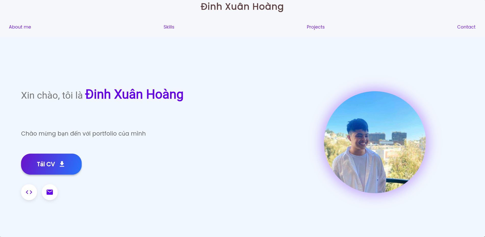
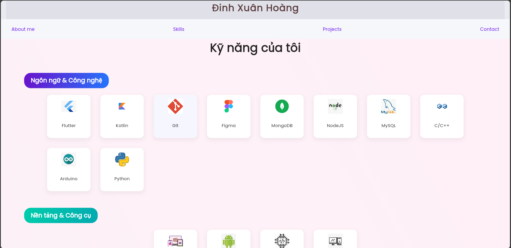
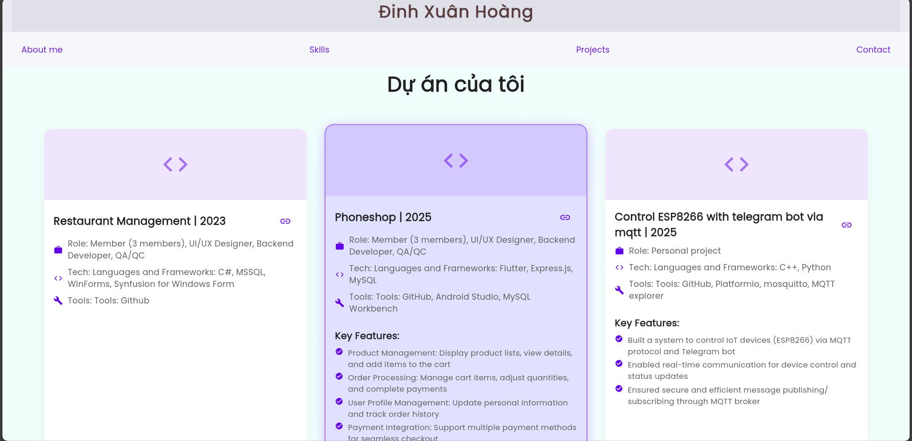
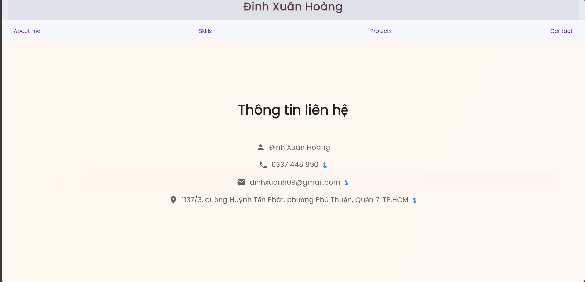

# Portfolio Cá Nhân Flutter

Bạn có thể vô trang web này để xem portfolio của mình https://dxhoangsteve.github.io/My_portfolio/

## Tính năng

- **Giao diện trên github io**: Trang web portfolio của tôi được deloy trên github io
- **Hiệu ứng chuyển cảnh**: Animations khi chuyển đổi và khi tương tác nhưng chưa được tối ưu 
- **Sections**:
  - Thông tin cá nhân
  - Kỹ năng
  - Dự án
  - Liên hệ

## Cài đặt

1. Đảm bảo Flutter đã được cài đặt trên máy tính của bạn
2. Clone repository này
3. Chạy lệnh sau để cài đặt dependencies:

```bash
flutter pub get
```

4. Chạy ứng dụng:

```bash
flutter run -d chrome
```

## Dependencies

Portfolio này sử dụng các thư viện sau:

- flutter_animate: Tạo các hiệu ứng animations
- flutter_staggered_animations: Tạo hiệu ứng staggered
- url_launcher: Mở link và download file
- google_fonts: Sử dụng Google Fonts
- shimmer: Tạo hiệu ứng shimmer loading
- lottie: Animations phức tạp

## Cấu trúc project

```
lib/
├── items/         # Data models và dữ liệu static
├── pages/         # Màn hình chính
├── styles/        # Colors, themes và styles
├── widgets/       # UI components
└── main.dart      # Entry point
```

## Tùy chỉnh

Bạn có thể tùy chỉnh portfolio bằng cách:

1. Thay đổi thông tin cá nhân trong các files trong thư mục `items/`
2. Thay đổi hình ảnh trong thư mục `assets/images/`
3. Điều chỉnh màu sắc trong `lib/styles/color.dart`
4. Điều chỉnh các kỹ năng trong `lib/items/skills.dart`


## Screenshots 

1 vài hình ảnh trong portfolio






## Lưu ý
Hiện tại portfolio này chưa được tối ưu hiệu xuất nên tốc độ phản hồi tương đối kém, animation chưa mượt mà
## License

MIT License
